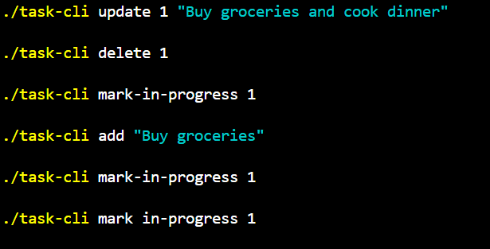

Task-CLI


Task-CLI is a command-line tool for efficient task management. With this simple application, you can create, update, delete, and track tasks directly from the command line. Tasks are stored in a JSON file, making data handling easy and persistent.


Features 🚀
Add, Update, and Delete tasks
Mark tasks as "in progress" or "done"
List all tasks or filter by status (todo, in-progress, done)
Persistent data storage using a JSON file
Installation 💻
Prerequisites
Python 3.x installed on your system.
Steps to Install
Clone the repository:

```
git clone https://github.com/richa9760/task-cli.git

```
Navigate to the project directory:


```cd task-cli```

Make the script executable (Linux/macOS only):

```chmod +x task-cli```

Run the Script
To run the task-cli, use:


```./task-cli [command] [arguments]```

Replace [command] and [arguments] with your desired action and data.

Usage Guide 📚
Add a Task

```./task-cli add "Your task description"```
Adds a new task with the provided description.

List All Tasks

```./task-cli list```
Displays all tasks stored in the JSON file.

List Tasks by Status

```./task-cli list --status done```
Lists tasks filtered by the specified status (todo, in-progress, or done).

Update a Task

```./task-cli update <task_id> "Updated task description"```
Updates the task description for the given task ID.

Mark a Task as In Progress

```./task-cli update <task_id> --status in-progress```
Mark a Task as Done

```./task-cli update <task_id> --status done```
Delete a Task

```./task-cli delete <task_id>```
Deletes the task with the specified task ID.

Example Commands 🎯
Command	Description
```./task-cli add "Write README"	Adds a new task named "Write README"
./task-cli list --status todo	Lists all tasks with the status "todo"
./task-cli update 1 --status done	Marks task ID 1 as done
./task-cli delete 2	Deletes task ID 2```
Screenshots 📸



License 📜
This project is licensed under the MIT License. See the LICENSE file for details.

Acknowledgements 🙏
Thanks to the open-source community for providing the tools and frameworks that make this project possible, including:

Python
Git
Contributing 🤝
We welcome contributions! If you'd like to help improve task-cli, please:

Fork the repository.
Create a new branch (git checkout -b feature-branch).
Make your changes and commit (git commit -am 'Add new feature').
Push to the branch (git push origin feature-branch).
Create a new Pull Request.